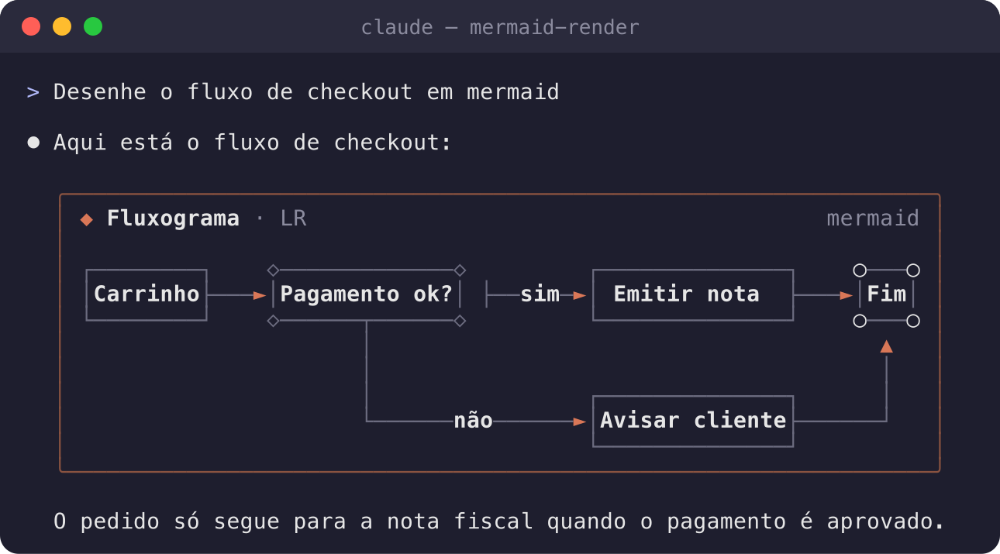
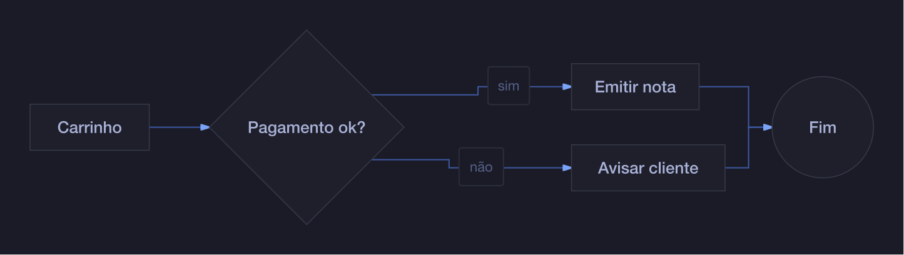
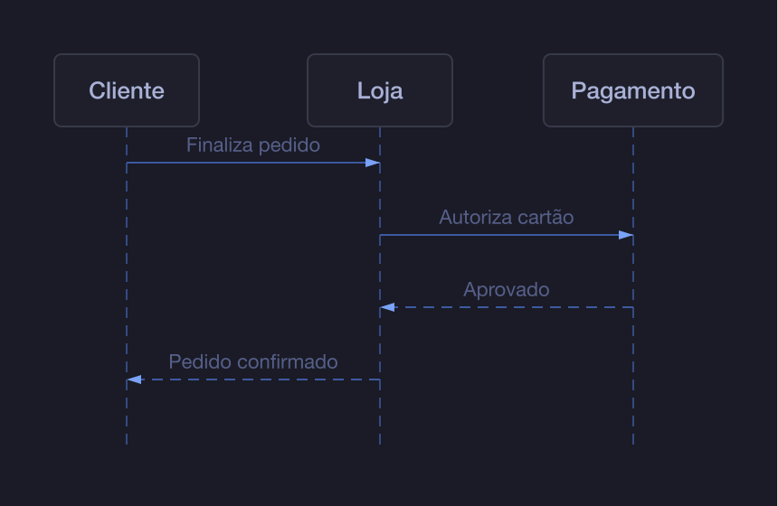
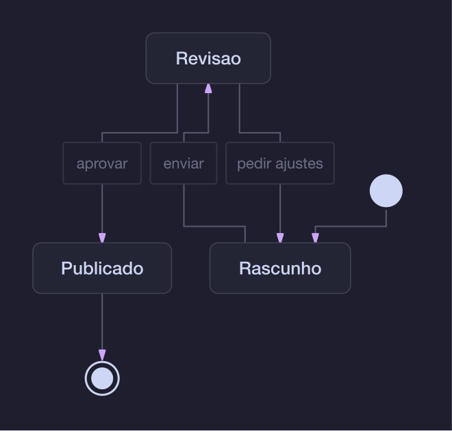

# mermaid-render: Mermaid diagrams rendered inside Claude Code

[](https://github.com/ejklock/claude-mermaid-render/actions/workflows/ci.yml)
[](https://github.com/ejklock/claude-mermaid-render/releases)
[](LICENSE)
[](https://docs.claude.com/en/docs/claude-code/plugins)

**mermaid-render** is a Claude Code plugin that turns every Mermaid diagram
Claude **writes** in a reply, **reads**, **writes**, **edits** or **prints** in
a file or a command's output, into a
rendered diagram right in the transcript: a colored Unicode card in any
terminal, a real SVG in the Claude Code desktop app and VS Code.

No more reading raw `flowchart LR` source. Flowcharts, sequence diagrams,
state diagrams, class diagrams and ER diagrams show up as pictures.



## Quick install

In Claude Code, run:

```
/plugin marketplace add ejklock/claude-mermaid-render
/plugin install mermaid-render@mermaid-render
```

Or in one line:

```
/plugin install mermaid-render --marketplace ejklock/claude-mermaid-render
```

Answer `y` to add the marketplace and pick a scope (user scope is the
default). The plugin is active at once, with no restart.

**Requirements:** Claude Code 2.1.292 or newer (function-hook plugins).
Node.js 20+ for the SVG renderer (desktop, VS Code, and the terminal `image`
mode). `rsvg-convert` only for the `image` mode
(`brew install librsvg` / `apt install librsvg2-bin`).

## What it renders

| Where | When | How it looks |
| --- | --- | --- |
| Claude's replies | A closed ```mermaid fence in the answer | Prose stays Markdown; each diagram becomes a titled card |
| Tool rows | `Read` or `Write` of a `.mmd` / `.mermaid` file, or a `.md` file with mermaid fences | The diagrams appear under the tool row |
| Tool rows | A finished `Bash` run whose output holds a closed mermaid fence, or that prints a whole `.mmd` / `.mermaid` file (`cat`, `sed -n`) | The command's own row and output stay; each diagram appears as a card under it |
| Tool rows | A finished `Edit` of a `.md` file, for each mermaid fence the edit touched; of a `.mmd` / `.mermaid` file, the whole updated diagram | The edit's own diff stays; the updated diagrams appear as cards under it |
| Any terminal | Default `unicode` mode | Box-drawing art: bold labels, soft lines, accent-colored arrows |
| Ghostty, kitty, WezTerm | `image` mode | The real SVG, drawn as a picture (kitty graphics protocol) |
| Desktop app, VS Code | Always | Native SVG |

Details that keep it pleasant:

- A fence that is still streaming stays text until it closes.
- A horizontal flowchart that does not fit the terminal is laid out vertically.
- A diagram that does not parse shows the reason and its source, never a blank.
- Mermaid fences shown inside another fence (documentation) are left alone.

## SVG themes

The desktop SVG and the terminal `image` mode use the diagram themes of
[beautiful-mermaid](https://www.npmjs.com/package/beautiful-mermaid):

| Flowchart, `tokyo-night` | Sequence, `tokyo-night` | State, `catppuccin-mocha` |
| --- | --- | --- |
|  |  |  |

## Configuration

Open `/plugin`, select **mermaid-render**, then **Configure**:

| Option | Values | Default |
| --- | --- | --- |
| `terminalRender` | `unicode` (any terminal), `image` (kitty graphics terminals) | `unicode` |
| `theme` | `tokyo-night`, `tokyo-night-storm`, `catppuccin-mocha`, `dracula`, `nord`, `one-dark`, `github-dark`, `zinc-dark`, `solarized-dark`, `github-light`, `catppuccin-latte`, `zinc-light` | `tokyo-night` |

Inside tmux or another multiplexer that does not pass graphics through, keep
`unicode`.

## Try it

After installing, ask Claude:

> Draw the checkout flow of an online store as a Mermaid flowchart.

Or read one of the demo files in this repository:

> Read demo/checkout.mmd and demo/architecture.md

## Supported diagram types

`flowchart` / `graph`, `sequenceDiagram`, `stateDiagram` / `stateDiagram-v2`,
`classDiagram`, `erDiagram`. Other types (`pie`, `gantt`, `mindmap`, ...)
show a short notice and their source.

Card labels are in Portuguese today (`Fluxograma`, `Sequência`, ...).

## How it works

The plugin is a Claude Code function-hook module
([hooks/register.tsx](hooks/register.tsx)). It hooks `ui.render` for
`AssistantMessage`, `ToolUse` and `ToolGroup`, finds mermaid fences with a
CommonMark-style parser ([hooks/fences.ts](hooks/fences.ts)) and draws a TSX
tree per diagram.

- **Unicode art** runs in-process with beautiful-mermaid's ASCII renderer
  (`hooks/vendor/mermaid.js`, about 84 KB).
- **SVG** needs the ELK layout engine, too large for an in-process import, so
  `renderer/svg.mjs` runs it under Node. It flattens CSS variables to plain
  colors, so any SVG renderer (including `rsvg-convert`) draws it right.
- Results are cached per diagram, theme and width.

## Development

```sh
npm ci
npm run build          # rebuilds hooks/vendor/mermaid.js and renderer/svg.mjs
npm run validate       # claude plugin validate .
npm test               # claude plugin test .
npm run screenshots    # regenerates docs/images (needs rsvg-convert)
claude --plugin-dir .  # try the working copy in a session
```

The images in `docs/images` are generated by `scripts/screenshots.mjs` from
the plugin's own renderers. The terminal picture draws the plugin's real
Unicode output inside a terminal frame.

## Related

- [claude-mermaid-terminal](https://github.com/ejklock/claude-mermaid-terminal):
  a skill that pastes Mermaid diagrams as Unicode text into the reply.

## License

MIT. Bundled third-party code is listed in
[THIRD_PARTY_NOTICES.md](THIRD_PARTY_NOTICES.md).
