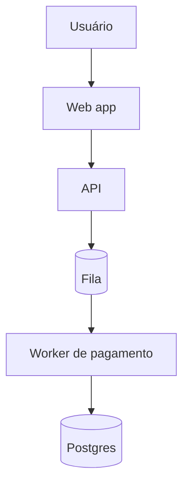
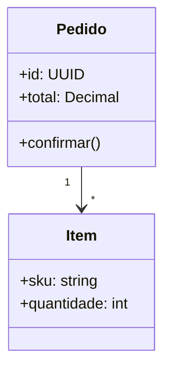
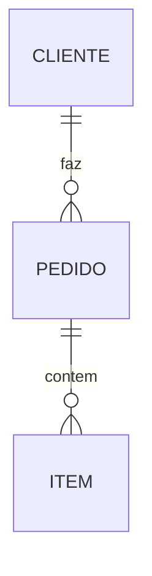

# Demo: architecture notes

The service accepts orders and hands them to payment.

```mermaid
flowchart TD
  U[Usuário] --> W[Web app]
  W --> A[API]
  A --> Q[(Fila)]
  Q --> P[Worker de pagamento]
  P --> DB[(Postgres)]
```

The domain model:

```mermaid
classDiagram
  class Pedido {
    +id: UUID
    +total: Decimal
    +confirmar()
  }
  class Item {
    +sku: string
    +quantidade: int
  }
  Pedido "1" --> "*" Item
```

And the tables behind it:

```mermaid
erDiagram
  PEDIDO ||--o{ ITEM : contem
  CLIENTE ||--o{ PEDIDO : faz
```
